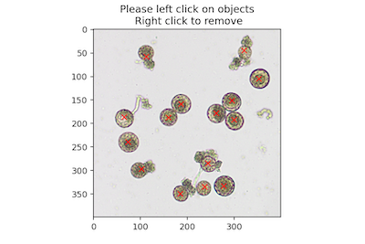
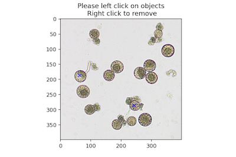

## Interactive Point Annotation Tool

Using [Jupyter Notebooks](https://plantcv.readthedocs.io/en/stable/jupyter/) it is possible to interactively click to collect coordinates from an image, which can be used in various downstream applications. Left click on the image to collect a point. Right click removes the
closest collected point.

**plantcv.annotate.Points**(*img, figsize=(12,6), label="dafault"*)

**returns** interactive image class

- **Parameters:**
    - img - Image data
    - figsize - Interactive plot figure size (default = (12,6))
    - label - The current label (default = "default")

- **Attributes:**
    - coords - dictionary of all coordinates per group label
    - events - includes right and left click events
    - count - dictionary that save the counts of different groups (labels)
    - label - the current label
    - sample_labels - list of all sample labels, one to one with coordinates collected 
    - view_all - flag indicating whether or not to view all labels 
    - color - current color 
    - colors - all used colors 
    - figsize - size of the interactive plotting figure 

- **Context:**
    - Used to define a list of coordinates of interest.
- **Example use:**
    - pcv.roi.multi
    - pcv.roi.custom


```python
import plantcv.plantcv as pcv 
import plantcv.annotate as an

# Create an instance of the Points class
marker = an.Points(img=img, figsize=(12,6))

# Click on the plotted image to collect coordinates

# Use the identified coordinates to create a custom polygon ROI
roi = pcv.roi.custom(img=img, vertices=marker.coords['default'])

```

**plantcv.annotate.Points.save_coords**()

- **Context:**
    - Once point annotations are collected, save the list of coordinates with their class label to Outputs and later saved out to file 

**plantcv.annotate.Points.save_counts**()

- **Context:**
    - Once point annotations are collected, save the dictionary of counts with their class label to Outputs and later saved out to file

- **Example use:**
    - Remove noise from a microscopy image that is otherwise difficult to filter out with traditional computer vision
    techniques, and recover stomata that were filtered out during mask cleaning. 

**Original Image with Annotations: "total" pollen**



**Original Image with Annotations: "germinated" pollen**



```python
import plantcv.plantcv as pcv 
import plantcv.annotate as pcvan

# Create an instance of the Points class
img, path, name = pcv.readimage("stomata.tif")

# Segmentation & mask clean up steps here 

# Create an instance of the Points class & click on stomata
marker = pcvan.Points(img=img, figsize=(12,6))

marker.save_coords()
marker.save_counts()

pcv.outputs.observations

{'total': {'coordinates': {'trait': 'collected coordinates',
   'method': 'annotation',
   'scale': 'none',
   'datatype': "<class 'list'>",
   'value': [(113, 58),
    (353, 105),
    (74, 240),
    (103, 297),
    (278, 333),
    (185, 350),
    (237, 335),
    (244, 285),
    (300, 192),
    (295, 151),
    (262, 178),
    (321, 44),
    (187, 158),
    (160, 187),
    (65, 186)],
   'label': 'none'},
  'object_count': {'trait': 'count of category',
   'method': 'count',
   'scale': 'count',
   'datatype': "<class 'int'>",
   'value': 15,
   'label': 'none'}},
 'germinated': {'coordinates': {'trait': 'collected coordinates',
   'method': 'annotation',
   'scale': 'none',
   'datatype': "<class 'list'>",
   'value': [(64, 186), (244, 286)],
   'label': 'none'},
  'object_count': {'trait': 'count of category',
   'method': 'count',
   'scale': 'count',
   'datatype': "<class 'int'>",
   'value': 2,
   'label': 'none'}}}
```

**Source Code:** [Here](https://github.com/danforthcenter/plantcv-annotate/blob/main/plantcv/annoate/classes.py)
