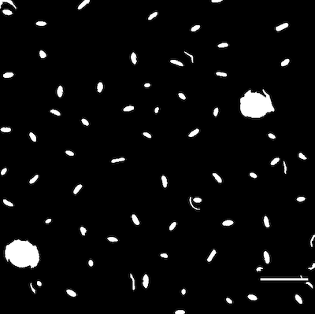
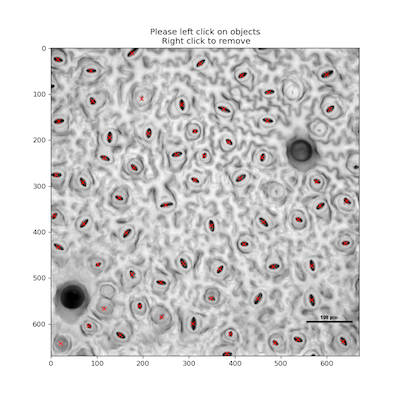
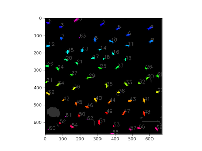

## Interactive Point Annotation Tool

Using [Jupyter Notebooks](https://plantcv.readthedocs.io/en/stable/jupyter/) it is possible to interactively click on an image to collect coordinates, which can be used in various downstream applications. Left click on the image to collect a point. Right click removes the
closest collected point.

**plantcv.annotate.Points**(*img, figsize=(12,6), label="dafault"*)

**returns** interactive image class

- **Parameters:**
    - img - Image data
    - figsize - Interactive plot figure size (default = (12,6))
    - label - The current label (default = "default")

- **Attributes:**
    - coords - dictionary of all coordinates per sample label
    - events - includes right and left click events
    - count - dictionary that save the counts of different groups (sample_labels)
    - label - the current label
    - sample_labels - list of all sample labels, one to one with coordinates collected 
    - view_all - flag indicating whether or not to view all labels 
    - color - current color 
    - colors - all used colors 
    - figsize - size of the interactive plotting figure 

- **Context:**
    - Used to define a list of coordinates of interest.
    - Can be helpful to ground truth counting algorithms, and exported coordinates could be used in other image analysis workflows.
- **Example use:**
    - [pcv.roi.multi](https://plantcv.readthedocs.io/en/stable/roi_multi/)
    - Shown below [pcv.roi.custom](https://plantcv.readthedocs.io/en/stable/roi_custom/)


```python
import plantcv.plantcv as pcv 
import plantcv.annotate as an

# Create an instance of the Points class
marker = an.Points(img=img, figsize=(12,6), label='default')

# Click on the plotted image to collect coordinates

# Use the identified coordinates to create a custom polygon ROI
roi = pcv.roi.custom(img=img, vertices=marker.coords['default'])

```

## Methods
### Correct a Mask using Point Annotations

Using [Jupyter Notebooks](https://plantcv.readthedocs.io/en/stable/jupyter/) it is possible to interactively click to collect coordinates from an image, then use these coordinate to remove and recover objects from a binary mask.

**plantcv.annotate.Points.correct_mask**(*bin_img*)

**returns** corrected_mask, num

- **Parameters:**
    - bin_img - binary image, filtered mask image with selected objects
    
- **Returns:**
    - corrected_mask - A labeled mask with non-annotated objects filtered out, and unresolvable annotations marked with a single, labeled pixel. 
    - num - The number of unique objects in the `corrected_mask`.

- **Context:**
    - Filters objects from the `bin_mask` if they do not overlap with an annotation in the `Points` class instance. 
    - Adds a labeled pixel to the corrected mask if an object cannot be resolved for any annotations (false negatives can be counted but cannot have their size measured downstream). 
    - Returns the number of unique objects in the `corrected_mask` which is useful for downstream analysis.
    - Debug image is a colorized representation of the labeled mask. The "unresolved" annotation replicates are plotted with a radius of `pcv.params.line_thickness` (default = 5). 

- **Example use:**
    - Remove noise from a microscopy image that is otherwise difficult to filter out with traditional computer vision
    techniques, and recover stomata that were filtered out during mask cleaning. 

**bin_img**



**Original Image with "auto-detected" Annotations**


```python
import plantcv.plantcv as pcv 
import plantcv.annotate as pcvan

# Create an instance of the Points class
img, path, name = pcv.readimage("stomata.tif")

# Segmentation & mask clean up, get_centroids steps here 

# Create an instance of the Points class & click on stomata
marker = pcvan.Points(img=img, figsize=(12,6))
marker.import_list(coords=centroid_coords, label="stomata")

# Filter the binary mask based on corrected annotations
corrected_mask, num = marker.correct_mask(bin_img=bin_mask)

# Analysis steps here
size_img = pcv.analyze.size(img=img, labeled_mask=corrected_mask, n_labels=num)
```
**Annotations After Human Corrections**



**Corrected (and [Colorized](https://plantcv.readthedocs.io/en/stable/visualize_colorize_label_img/)) Mask**



**Size Analysis Image**


**Source Code:** [Here](https://github.com/danforthcenter/plantcv-annotate/blob/main/plantcv/annoate/classes.py)
