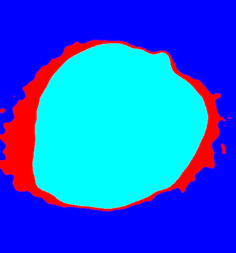

## Join Labels with Napari

This function joins classes with the same label. This function would be run after classes are labeled with napari_label_classes.

**plantcv.annotate.napari_join_labels**(*img, viewer*)

**returns** relabeled mask, dictionary of masks for each class

- **Parameters:**
    - img - image data (compatible with gray, RGB, and hyperspectral data. If data is hyperspecral it should be the array e.g. hyperspectral.array_data)
    - viewer - viewer with labeled classes(likely created with [`napari_label_classes`](napari_label_classes.md)).
        If no points are selected for a class,
        data without labels will default to this class when napari_join_labels
        is run. If all classes have points labeled, any clusters not labeled
        will default to the last class in the list if napari_join_labels is
        run. 

- **Context:**
    - This function would be run after labeling classes in Napari is complete. 

- **Example use:**
    - Joining classes labeled as the same, for example for joining classes from output of kmeans clustering


```python
import plantcv.plantcv as pcv 
import plantcv.annotate as pcvan
import napari

# Create an instance of the Points class
img, path, name = pcv.readimage("./grayimg.png")

viewer = pcvan.napari_label_classes(img=img, ['background', 'wing','seed'])

# Should open interactive napari viewer

labeledmask, mask_dict = pcvan.napari_join_lables(img=img, viewer=viewer)

```





**Source Code:** [Here](https://github.com/danforthcenter/plantcv-annotate/blob/main/plantcv/annotate/napari_label_classes.py)
