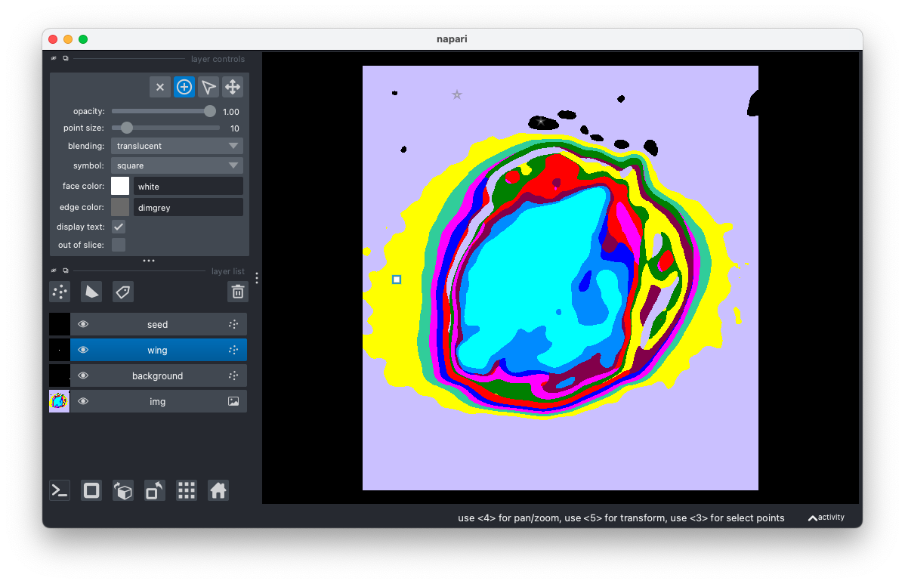

## Label Image with Napari

This function opens an image in Napari and then defines a set of Points layers with the user-defined labels called `classes`. A random `shape` of the annotation symbol is assigned to each of the `classes`. 
Image can be annotated as long as viewer is open. 


**plantcv.annotate.napari_label_classes*(*img, classes, size=10, importdata=False, show=True*)

**returns** napari viewer object

- **Parameters:**
    - img - image data (compatible with gray, RGB, and hyperspectral data. If data is hyperspecral it should be the array e.g. hyperspectral.array_data)
    - classes - list of classes to label. This option is not necessary if data is data is imported.
    - size - integer pixel size of label (also adjustable from the interactive Napari viewer)
    - importdata - dictionary of data, data saved from napari_save_coor or data imported from napari_read_coor
    - show - if `show=True`, viewer is launched. `False` setting is useful for test purposes.

- **Context:**
    - Adding one or more classes of points layer for annotation of the image.

- **Example use:**
    - Ground truth counting, labeling classes of objects of interest.


```python
import plantcv.plantcv as pcv 
import plantcv.annotate as pcvan
import napari

# Create an instance of the Points class
img, path, name = pcv.readimage("./grayimg.png")

# Opens interactive napari viewer
viewer = pcvan.napari_label_classes(img=img, classes=['background', 'wing','seed'], size=30)

```




**Source Code:** [Here](https://github.com/danforthcenter/plantcv-annotate/blob/main/plantcv/annotate/napari_label_classes.py)
