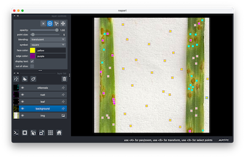
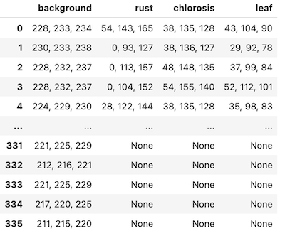

## Extract Color Data from Dictionary of Masks for Naive Bayes

This function is to extract color information from a dictionary of masks in order
to get data for naive bayes functions.

**plantcv.annotate.napari_naive_bayes_color*(*img, maskdict, filename)

**returns** data frame

- **Parameters:**
    - img - RGB image to extract color information from
    - maskdict - dictionary of masks, output of napari_points_mask for example
    - filename - filename to save data, formatted to work with naive bayes functions

- **Context:**
    - This function is used to extract color information from an RGB image and a mask and convert data 
    to be compatible with Naive Bayes training functions. 

- **Example use:**
    - used in Napari Naive Bayes


```python
import plantcv.plantcv as pcv 
import plantcv.annotate as pcvan
import napari

# Create an instance of the Points class
img, path, name = pcv.readimage("./wheat.png")

viewer = pcvan.napari_label_classes(img,['background','healthy', 'rust', 'chlorosis'], size = 4)

maskdict = pcvan.napari_points_mask(img,viewer)

nbdata = pcvan.napari_naive_bayes_color(img, maskdict, "./nbdata.txt")

# Should open interactive napari viewer

```



***Output Data***




**Source Code:** [Here](https://github.com/danforthcenter/plantcv-annotate/blob/main/plantcv/annotate/napari_points_mask.py)
