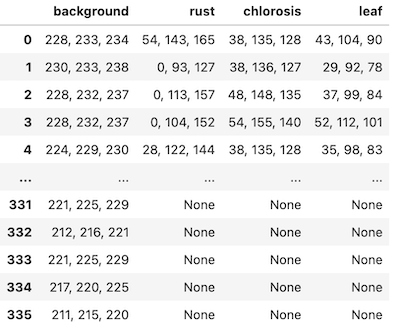

## Extract Color Data from Dictionary of Masks for Naive Bayes

This function is to extract color information from a dictionary of masks in order
to get data for naive bayes functions.

**plantcv.annotate.napari_naive_bayes_colors**(*img, maskdict, filename*)

**returns** data frame

- **Parameters:**
    - img - RGB image to extract color information from
    - maskdict - dictionary of masks, output of [`napari_points_mask`](docs/napari_points_mask.md) for example
    - filename - filename to save data, formatted to work with [Naive Bayes segmentation](https://plantcv.readthedocs.io/en/latest/tutorials/machine_learning_tutorial/)

- **Context:**
    - This function is used to extract color information from an RGB image and a mask and convert data 
    to be compatible with Naive Bayes training functions. 

- **Example use:**
    - used in Napari Naive Bayes


```python
import plantcv.plantcv as pcv 
import plantcv.annotate as pcvan
from plantcv import learn
import napari

# Create an instance of the Points class
img, path, name = pcv.readimage("./wheat.png")

# Should open interactive napari viewer
viewer = pcvan.napari_label_classes(img=img, classes=['background','healthy', 'rust', 'chlorosis'], size=4)

maskdict = pcvan.napari_points_mask(img, viewer)

nbdata = pcvan.napari_naive_bayes_colors(img=img, maskdict=maskdict, filename="./nbdata.txt")

learn.naive_bayes_multiclass(samples_file="./nbdata.txt", outfile="naive_bayes_test_pdfs.txt")

masks = pcv.naive_bayes_classifier(rgb_img=img, 
                                   pdf_file="./naive_bayes_test_pdfs.txt")

```


***Output Data***




**Source Code:** [Here](https://github.com/danforthcenter/plantcv-annotate/blob/main/plantcv/annotate/napari_naive_bayes_colors.py)
