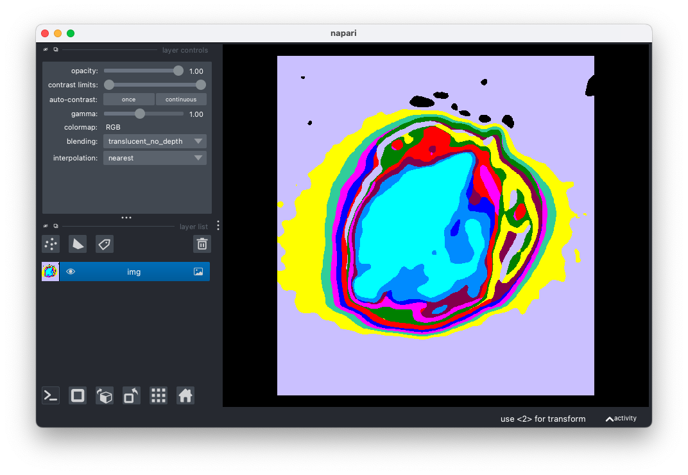

## Open Image with Napari

Open image data (e.g. RGB, gray, hyperspectral) with an interactive Napari viewer. If a gray image is opened, the image will be pseudocolored for better visualization.

**plantcv.annotate.napari_open**(*img, viewer*)

**returns** napari viewer object

- **Parameters:**
    - img - image data (compatible with gray, RGB, and hyperspectral data. If data is hyperspecral it should be the array e.g. hyperspectral.array_data)
    - viewer - Napari viewer object

- **Context:**
    - Used to open image data with Napari.

- **Example use:**
    - Open image data to annotate it with other Napari functions (e.g. napari_label_classes)


```python
import plantcv.plantcv as pcv 
import plantcv.annotate as pcvan

# Create an instance of the Points class
img, path, name = pcv.readimage("./grayimg.png")

viewer = napari.Viewer()

viewer = pcvan.napari_open(img=img, viewer=viewer)

# Should open interactive napari viewer

```




**Source Code:** [Here](https://github.com/danforthcenter/plantcv-annotate/blob/main/plantcv/annotate/napari_open.py)
