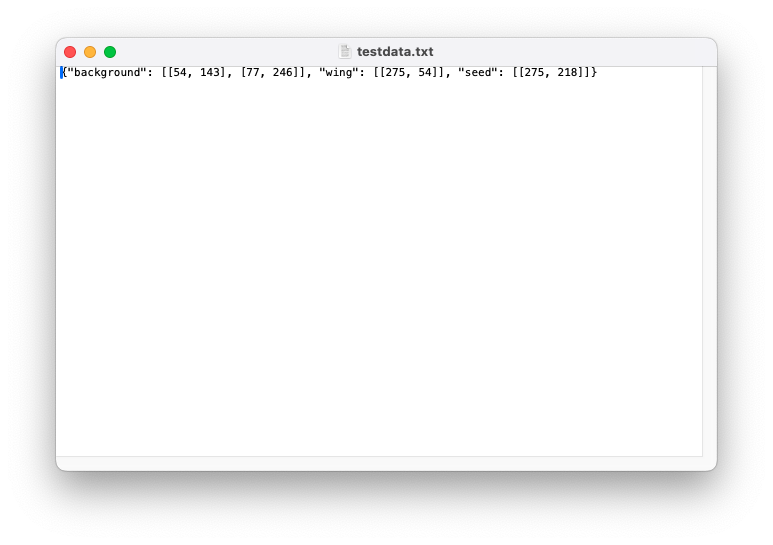

## Save Napari Labels to File

Save Points Labeled in Napari to a File

**plantcv.annotate.napari_save_coor**(*viewer, filepath*)

**returns** dictionary of points labeled by class

- **Parameters:**
    - viewer - Napari Viewer Object
    - Filepath - File to save data. If the file exits an extension will be added.

- **Context:**
    - Save points labeled in Napari to a file in case the same points need to be used.

- **Example use:**
    - Save points labeled to a file 


```python
import plantcv.plantcv as pcv 
import plantcv.annotate as pcvan

# Create an instance of the Points class
img, path, name = pcv.readimage("./grayimg.png")

viewer = pcvan.napari_label_classes(img=img, classes=['background', 'wing','seed'])

dictobj = pcvan.napari_save_coor(viewer, 'testdata.txt')

# Should open interactive napari viewer

```





**Source Code:** [Here](https://github.com/danforthcenter/plantcv-annotate/blob/main/plantcv/annotate/napari_save_coor.py)
