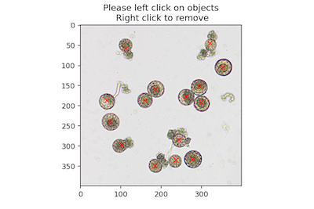
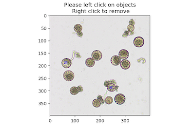

## Save Annotations to PlantCV Outputs

Using [Jupyter Notebooks](https://plantcv.readthedocs.io/en/stable/jupyter/) it is possible to interactively click to collect coordinates from an image, then save the `counts` or coordinates (`coords`) to the [PlantCV Outputs class](https://plantcv.readthedocs.io/en/stable/outputs/).

**plantcv.annotate.Points.save_coords**()

- **Context:**
    - Once point annotations are collected, save the list of coordinates with their class label to Outputs and later saved out to file with 

- **Example use:**
    - Remove noise from a microscopy image that is otherwise difficult to filter out with traditional computer vision
    techniques, and recover stomata that were filtered out during mask cleaning. 

**Original Image with Annotations: "total" pollen**



**Original Image with Annotations: "germinated" pollen**



```python
import plantcv.plantcv as pcv 
import plantcv.annotate as pcvan

# Create an instance of the Points class
img, path, name = pcv.readimage("stomata.tif")

# Segmentation & mask clean up steps here 

# Create an instance of the Points class & click on stomata
marker = pcvan.Points(img=img, figsize=(12,6))

marker.save_coords()
marker.save_counts()

pcv.outputs.observations

{'total': {'coordinates': {'trait': 'collected coordinates',
   'method': 'annotation',
   'scale': 'none',
   'datatype': "<class 'list'>",
   'value': [(113, 58),
    (353, 105),
    (74, 240),
    (103, 297),
    (278, 333),
    (185, 350),
    (237, 335),
    (244, 285),
    (300, 192),
    (295, 151),
    (262, 178),
    (321, 44),
    (187, 158),
    (160, 187),
    (65, 186)],
   'label': 'none'},
  'object_count': {'trait': 'count of category',
   'method': 'count',
   'scale': 'count',
   'datatype': "<class 'int'>",
   'value': 15,
   'label': 'none'}},
 'germinated': {'coordinates': {'trait': 'collected coordinates',
   'method': 'annotation',
   'scale': 'none',
   'datatype': "<class 'list'>",
   'value': [(64, 186), (244, 286)],
   'label': 'none'},
  'object_count': {'trait': 'count of category',
   'method': 'count',
   'scale': 'count',
   'datatype': "<class 'int'>",
   'value': 2,
   'label': 'none'}}}
```

**Source Code:** [Here](https://github.com/danforthcenter/plantcv-annotate/blob/main/plantcv/annotate/classes.py)
